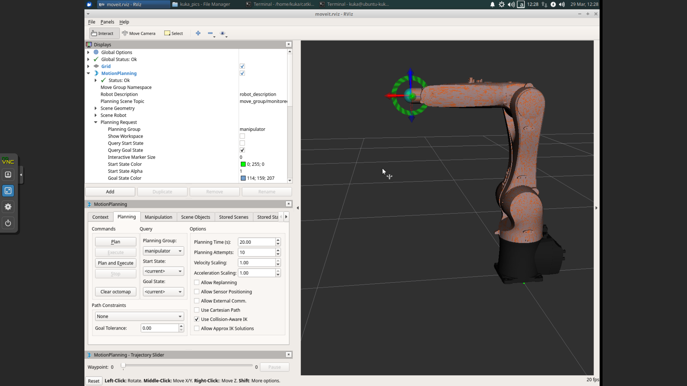

https://www.youtube.com/watch?v=GxlYxaykqTU

** في هذه المقالة سنقوم بشرح بعض خطوات التثبيت والتشغيل لإعداد روبوت الرسام. المتطلبات:**
- KUKA KR6 R900 sixx مع KRC4 و SmartPad؛
- Intel NUC مع [ROS melodic](http://wiki.ros.org/melodic/تثبيتation/Ubuntu) مثبت؛
- طاولة ودهان وفرشاة وماء.

## تثبيت البرامج على KRC4
مطلوب واجهة EKI على كل من KRC4 و NUC. يتم تقديم معلومات مفصلة حول كيفية إعدادها على KRC4 [هنا](https://github.com/AlexeiOvcharov/kuka_experimental/tree/a915bf4e932990379c84164713e7ae11a24a2a13/kuka_eki_hw_interface/krl). قم بتشغيلها على تحكم الروبوت.

## تثبيت البرامج على NUC
إنشاء مساحة عمل catkin:
```
mkdir -p ~/catkin_ws/src
cd ~/catkin_ws/
catkin build
```
تنزيل حزم ROS. يتم تخزين جميع النصوص [هنا](https://github.com/airalab/robot_painter/tree/test_branch). استنساخ المستودع:
```
cd src
git clone --branch test_branch https://github.com/airalab/robot_painter
cd robot_painter
rm -rf scenes
mv * ../
cd ..
rmdir robot_painter
```
قد تحتاج إلى بعض ملفات الرأس والمكتبات لجعل كل شيء يعمل بشكل صحيح. قم بتنزيلها:
```
cd ~
git clone https://github.com/PaTara43/kuka_moveit_webots
cd kuka_moveit_webots
sudo mv -r headers/* usr/include/c++/7/
sudo mv libs/* usr/local/lib/
cd ~
svn checkout https://github.com/PX4/Matrix/trunk/matrix
mv matrix -r /usr/include/c++/7/
sudo apt-get install ros-melodic-brics-actuator
cd ~/catkin_ws
catkin build
```
أضف أمر المصدر إلى ملف `.bashrc`:
```
echo “source ~/catkin_ws/devel/setup.bash” >> ~/.bashrc
source ~/.bashrc
```
حتى الآن. يجب أن تكون قادرًا على تشغيل النصوص. إذا حدث خطأ ما ، جرب بعض [إجراءات الاستكشاف والإصلاح](https://github.com/airalab/robot_painter/issues)

## ملء الثوابت
أولاً وقبل كل شيء ، يحتاج الروبوت إلى معرفة موقع واتجاه القماش وكذلك موقع علبة الدهان. يتم تحديد كل ذلك في `fake_painter_enviroment_tf/src/tf_broadcaster.cpp`. دعنا نلقي نظرة عليه.
```
// Plane constants
const double A = -0.0641;
const double B = 0.0214;
const double C = 0.9977;
const double D = -0.2198;

// Canvas transform
const double px = 0.52;
const double py = -0.24;
const double qx = -0.011;
const double qy = -0.032;
const double qz = 0.0;
const double qw = 0.999;
```
هذه هي ثوابت معادلة السطح التي تحدد موقع القماش في الفضاء ثلاثي الأبعاد. يتم الحصول عليها خلال عملية معايرة موضحة أدناه. يأتي بعدها الدهان.
```
colorTransform.transform.translation.x = 0.5;
colorTransform.transform.translation.y = 0.2;
colorTransform.transform.translation.z = 0.258;
```
هذه هي إحداثيات علبة الدهان. يمكن أيضًا تحديدها أثناء عملية المعايرة. يتم تحديد حجم القماش في
```
canvas.width = 0.5;
canvas.height = 0.4;
```
تخزين الثوابت المهمة الأخرى في `local_task_planner/src/Drawing.cpp`:
```
const double COLOR_BOTLE_HEIGHT = 0.06;
const double COLOR_HEIGHT = 0.045;
const double HEIGHT_OFFSET = COLOR_BOTLE_HEIGHT - COLOR_HEIGHT + 0.02;
const double BRUSH_HEIGHT = 0.01;
const double BRUSH_WIDTH = 0.01;
```
أسماؤهم تقول كل شيء ، لذا قم بملئها وفقًا للحالة.

## معايرة Gaka-Chu
عملية المعايرة نفسها بسيطة جدًا.

1) قم بتشغيل واجهة EKI على KRC4:

قم بتسجيل الدخول في وضع 'AUT' ، وقم بتشغيل السائقين وتشغيل النص `eki_hw_interface`

2) قم بتشغيل واجهة EKI على NUC
```
roslaunch kuka_eki_hw_interface test_hardware_interface.launch
```
يجب أن يظهر سجلات لا نهائية.

3) قم بتشغيل RViz
```
roslaunch kuka_moveit_config demo.launch
```
يجب أن ترى ما يلي:



حاول تحريك نهاية المؤثر والنقر على 'Plan and Execute'. يجب أن يتحرك الروبوت. انتقل إلى SmartPad وانتقل إلى **Display -> Actual position** وقم بمرقبة إحداثيات نهاية المؤثر. ضع قماشًا أفقيًا على قاعدة الروبوت. قم بتوصيل فرشاة في حامل الفرشاة وقم بتحريكها بعناية حتى تلامس القماش بالكاد. في هذا الموضع ، قم بحفظ إحداثيات نهاية المؤثر. كرر ذلك 12-15 مرة. قم أيضًا بحفظ إحداثيات مركز القماش وعلبة الدهان.
عندما تحصل على مجموعة من الإحداثيات ، استخدم [هذه](https://github.com/nakata5321/Matlab_scripts_gaka-chu) نصوص Matlab لحل الثوابت المفقودة والرباعي. الصقهم. قم بإعادة بناء مساحة العمل الخاصة بك باستخدام
```
cd ~/catkin_workspace
rm -rf build logs devel
catkin build
```

## اختبار معايرة Gaka-Chu
عندما يتم المعايرة ، يجب اختبار Gaka-Chu عن طريق رسم حدود القماش. لجعله يفعل ذلك ، قم بتنفيذ كل منها في نافذة الطرفية الجديدة:
```
roslaunch kuka_eki_hw_interface test_hardware_interface.launch
roslaunch kuka_moveit_config demo.launch
rosrun fake_painter_enviroment_tf tf_broadcaster
rosrun local_task_planner draw_workspace
```
بعد ذلك ، يجب أن ترى حدود القماش في RViz:


في الطرفية ، اضغط على "S" لأداء الاختبار. يجب أن يتحرك نهاية المؤثر للروبوت فوق حدود القماش ويجب أن تلامس الفرشاة القماش بلطف خلال الحركة بأكملها. إذا لم يحدث ذلك ، جرب إعادة المعايرة. إذا كانت نموذج القماش مدارًا بشكل خاطئ ، يمكنك تدويره عن طريق تغيير الرباعي في Matlab.

## صنع فن
تحتاج إلى 6 وحدات أساسية لجعل كل شيء يعمل:
- واجهة EKI؛
- MOVEit + RViz;
- بث إطارات البيئة؛
- خدمة تحويل الصورة؛
- وحدة رسم المسارات؛
- بدء المؤشر.

لنشغلهم واحدًا تلو الآخر.

### واجهة Eki
على KRC4 ، قم بتشغيل `eki_hw_interface` ، على NUC في نافذة الطرفية الجديدة قم بالتالي:
```
roslaunch kuka_eki_hw_interface test_hardware_interface.launch
```

### RViz و MOVEit
تحتاج إلى مخطط ومحاكاة. قم بتشغيلهما باستخدام
```
roslaunch kuka_moveit_config demo.launch
```

### البيئة
أخبر الروبوت بموقع علبة الدهان والقماش. لاحظ أنه ليس من الضروري تشغيل `draw workspace` node ، حيث يشترك `tf_broadcaster` في حجم القماش. فقط لا يظهر ذلك في RViz.
```
rosrun fake_painter_enviroment_tf tf_broadcaster
```

### معالج الصور
يجب معالجة جميع الصور الواردة. قم بتشغيل الخدمة.
```
rosrun picture_preprocessing TextConverter.py
```
عندما يتلقى الاتصال ، يقوم بمعالجة صورة بفلتر HP وإنشاء ملف rosbag مع المسارات.

### رسام المسارات
البرنامج النصي الأكثر أهمية هنا هو رسام المسارات نفسه. ينتظر الصورة ، ويستدعي خدمة TextConverter ويقوم برسم اللوحة.
```
rosrun local_task_planner trajectory_drawing
```

## أرسل للروبوت صورة للرسم
يستمع الروبوت إلى موضوع ROS محدد حيث تحتاج إلى تمرير مسار لصورة مرغوبة. يجب أن تكون الصورة مربعة (العرض يساوي الارتفاع) ومصنوعة من خطوط. أرسل المسار:
```
rostopic pub /run std_msgs/String "data: '<path_to_picture>'"
```
بعد ذلك. يظهر نافذتان تعرضان الحدود والمسارات. أغلقهما وانظر إلى رسم Gaka-Chu. كن حذرًا وكن دائمًا على استعداد للضغط على زر الإيقاف الطارئ.
عندما ينتهي Gaka-Chu من فنه ، يمكنك إرسال مسار آخر للصورة ويكرر الرسام العملية بأكملها.
