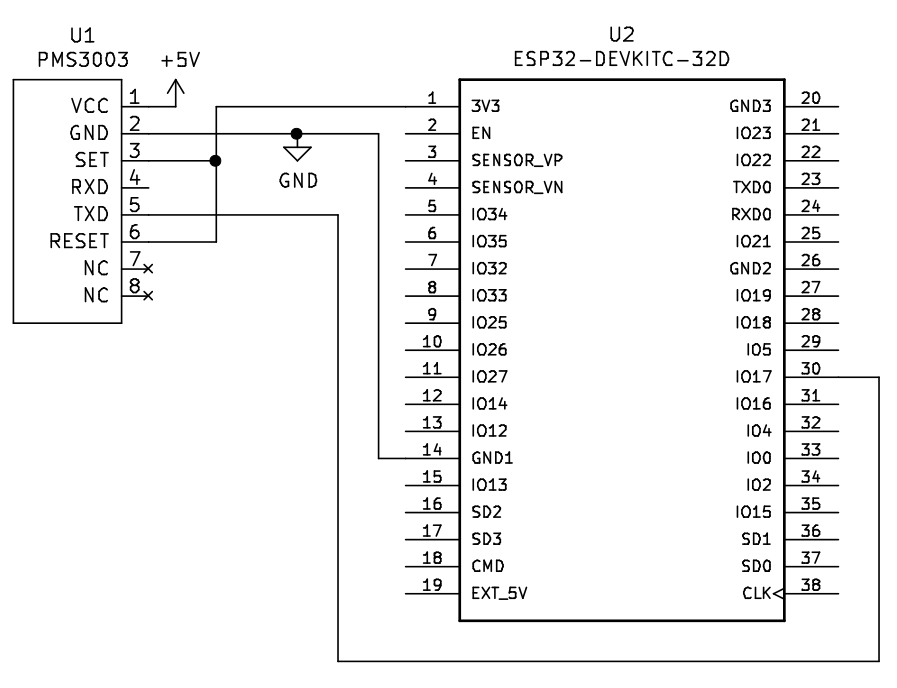

Εδώ είναι η επίδειξη του πώς ένας μικροελεγκτής που εκτελεί το [Amazon Web Services FreeRTOS](https://aws.amazon.com/freertos/) μπορεί να συνδεθεί στο δίκτυο Robonomics μέσω MQTT. Παρακαλούμε ελέγξτε [αυτό το αποθετήριο](http://github.com/khssnv/freertos_mqtt_robonomics_example) για τον πηγαίο κώδικα του έργου.

Χρησιμοποιούμε το [ESP32 DevKitC](https://devices.amazonaws.com/detail/a3G0L00000AANtjUAH/ESP32-WROOM-32-DevKitC/) με την διανομή FreeRTOS και την υλοποίηση MQTT που παρέχεται από το [Espressif IoT Development Framework](https://github.com/espressif/esp-idf) ενώ η Espressif είναι ο προμηθευτής του μικροελεγκτή που χρησιμοποιείται.

Επίσης, υπάρχει ένας αισθητήρας [PMS-3003](http://www.plantower.com/en/content/?107.html) για σκοπούς επίδειξης. Ο αισθητήρας μετρά την παρουσία σωματιδίων στον αέρα και μπορεί να χρησιμοποιηθεί για να εκτιμηθεί η ποιότητα του αέρα.

Η ποιότητα του αέρα δεν είναι θέμα του άρθρου, μπορείτε να βρείτε περισσότερες πληροφορίες στην ιστοσελίδα του ΠΟΥ: [Περιβαλλοντική (εξωτερική) ατμοσφαιρική ρύπανση](https://www.who.int/news-room/fact-sheets/detail/ambient-(outdoor)-air-quality-and-health). Ένας στόχος του συστήματος είναι να δημοσιεύει τις μετρήσεις του αισθητήρα στο δίκτυο Robonomics της Airalab.

## Ρύθμιση υλικού

Συνδέουμε το PMS3003 TXD PIN5 στο ESP32 DevKitC IO17 για να μεταφέρουμε τις μετρήσεις μέσω UART.
Και οι δύο συσκευές απαιτούν τροφοδοσία και κοινή γείωση.



## Ροή Δεδομένων

Για να παραδώσουμε τις μετρήσεις του αισθητήρα στο δίκτυο Robonomics, σε επίπεδο firmware, ο στόχος μας είναι να λάβουμε δεδομένα από έναν αισθητήρα μέσω του ενσωματωμένου πρωτοκόλλου επικοινωνίας που υποστηρίζει (UART στην περίπτωσή μας) και να τα περάσουμε στην περίπτωση του AIRA μέσω MQTT / TCP.


Στο παράδειγμά μας χρησιμοποιούμε την αναπτυξιακή πλατφόρμα AIRA που είναι διαθέσιμη με δημόσια διεύθυνση IP και όνομα τομέα.
Στην περίπτωση τυ AIRA, ρυθμίζουμε τον μεσολαβητή MQTT `mosquitto` και εγγραφόμαστε στο θέμα `/freertos_mqtt_robonomics_example/98:F4:AB:72:23:C4` για να λάβουμε μηνύματα από το MQTT.

Στη συνέχεια, περνάμε τα μηνύματα στον `robonomics io` writer μέσω αγωγού.


Τώρα τα δεδομένα είναι διαθέσιμα στο δίκτυο Robonomics και μπορούμε να τα διαβάσουμε ξανά με το `robonomics io`.

## Λογισμικό ενσωματωμένου συστήματος

Χρησιμοποιούμε την [εφαρμογή δείγματος ESP-MQTT με μεταφορά TCP](https://github.com/espressif/esp-idf/tree/master/examples/protocols/mqtt/tcp) ως βάση.

Μόνο τροποποιούμε το `main/app_main.c` για τη σύνδεση UART με τον αισθητήρα, τον χρονικό συγχρονισμό SNTP και την περιοδική δημοσίευση MQTT.

Εάν προσπαθείτε να επαναλάβετε το έργο και είναι το πρώτο έργο σας βασισμένο στο ESP IDF, παρακαλούμε ακολουθήστε αρχικά τον [οδηγό προγραμματισμού ESP-IDF της Espressif](https://docs.espressif.com/projects/esp-idf/en/latest/esp32/get-started/index.html#installation-step-by-step) για να εξοικειωθείτε με τις λειτουργίες του firmware όπως οι ρυθμίσεις, η δημιουργία και η μεταφόρτωση με το εργαλείο `idf.py`.

### Ρύθμιση Wi-Fi

Για να επικοινωνήσει ο μικροελεγκτής μας με το AIRA που είναι εγκατεστημένο στο cloud, απαιτείται σύνδεση στο Internet.
Χρησιμοποιούμε το Wi-Fi του ESP32 για αυτό.
Η Espressif παρέχει εργαλεία για τη ρύθμιση του ενσωματωμένου Wi-Fi.
Στο παράδειγμά μας χρησιμοποιούμε περιβάλλον ανάπτυξης με Ubuntu 20.04 GNU/Linux.
Για να ρυθμίσουμε το Wi-Fi, πηγαίνουμε στον φάκελο του έργου και εκτελούμε το εργαλείο ρύθμισης του SDK.

```console
cd freertos_mqtt_robonomics_example/firmware
idf.py menuconfig
```

Στη συνέχεια, ορίζουμε το SSID και τον κωδικό πρόσβασης του σημείου πρόσβασης Wi-Fi στην ενότητα `Example Σύνδεσηion Διαμόρφωση`.


### Ρύθμιση Τελικού Σημείου MQTT

Υπάρχουν δύο πράγματα που πρέπει να ρυθμίσουμε για το MQTT.
Το πρώτο είναι η διεύθυνση του μεσολαβητή MQTT.
Μπορεί να ρυθμιστεί με το εργαλείο ρύθμισης του SDK.

```console
cd freertos_mqtt_robonomics_example/firmware
idf.py menuconfig
```

Ορίστε το `Broker URL` στην ενότητα `Example Διαμόρφωση`.


Το δεύτερο πράγμα είναι το θέμα MQTT.
Το ορίζουμε στο firmware με το πρόθεμα του ονόματος του έργου ακολουθούμενο από τη διεύθυνση MAC του ESP32.
Αυτό μας δίνει `/freertos_mqtt_robonomics_example/98:F4:AB:72:23:C4` για το συγκεκριμένο μικροτσίπ.

## Από το MQTT στο Robonomics

Ας ελέγξουμε αρχικά αν λαμβάνουμε δεδομένα μέσω MQTT.
Μπορούμε να εγγραφούμε στο θέμα του μεσολαβητή MQTT Mosquitto που δημοσιεύει η συσκευή.

```console
$ nix-shell -p mosquitto --run "mosquitto_sub -h localhost -t '/freertos_mqtt_robonomics_example/98:F4:AB:72:23:C4'"
ts=1615651809, PM1=2, PM2.5=6, PM10=3
```

Εδώ φέρνουμε το πακέτο `mosquitto` στο περιβάλλον μας για να χρησιμοποιήσουμε το εργαλείο `mosquitto_sub`.
Στη συνέχεια εγγραφόμαστε στο θέμα που έχει οριστεί στο firmware.
Έχουμε τις μετρήσες μας, που σημαίνει ότι η AIRA λαμβάνει τα δεδομένα μέσω MQTT σωστά.
Τώρα ας διαβιβάσουμε αυτά τα μηνύματα στο Δίκτυο Robonomics.

```console
nix-shell -p mosquitto --run "mosquitto_sub -h localhost -t '/freertos_mqtt_robonomics_example/98:F4:AB:72:23:C4'" | robonomics io write pubsub --bootnodes=/ip4/127.0.0.1/tcp/34333 /freertos_mqtt_robonomics_example
```

Εδώ χρησιμοποιούμε το εργαλείο `robonomics` για να δημοσιεύσουμε μηνύματα στο κανάλι pubsub `/freertos_mqtt_robonomics_example`.
Καθορίζουμε τα `bootnodes` για να διασφαλίσουμε την εγκαθίδρυση τουλάχιστον μίας σύνδεσης.

Τώρα διαβάζουμε αυτά τα μηνύματα από το ίδιο κανάλι pubsub.

```console
$ robonomics io read pubsub --listen /ip4/127.0.0.1/tcp/34333 /freertos_mqtt_robonomics_example
2021-03-27 15:15:51  Generated random peer id: 12D3KooWB2nym5E6c3aPpnPKK5wB9Z6n9eZzcXSpyUBozxhi6dam
2021-03-27 15:15:51  Subscribed to topic: _robonomics_pubsub_peer_discovery
2021-03-27 15:15:51  Subscribed to topic: /freertos_mqtt_robonomics_example
2021-03-27 15:15:56  New peer connected: PeerId("12D3KooWRPLCioD2b9XLZTZJQELSAuQAyTrHUKzRktrQHtTSs6kS")
2021-03-27 15:15:56  GRAFT: Mesh link added for peer: PeerId("12D3KooWRPLCioD2b9XLZTZJQELSAuQAyTrHUKzRktrQHtTSs6kS") in topic: TopicHash { hash: "_robonomics_pubsub_peer_discovery" }
ts=1616843855, PM1=3, PM2.5=4, PM10=3
```

## Αρχικοί πόροι που χρησιμοποιήθηκαν

* Διάταξη ακίδων ESP32 DevKitC από το ιστολόγιο του GoJimmy https://gojimmypi.blogspot.com/2017/03/jtag-debugging-for-esp32.html
* Δομή δεδομένων και αποκωδικοποιητής PSM3003 από το OpenAirProject https://github.com/openairproject/sensor-esp32

**Σας ευχαριστούμε όλους!**
