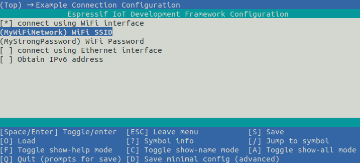
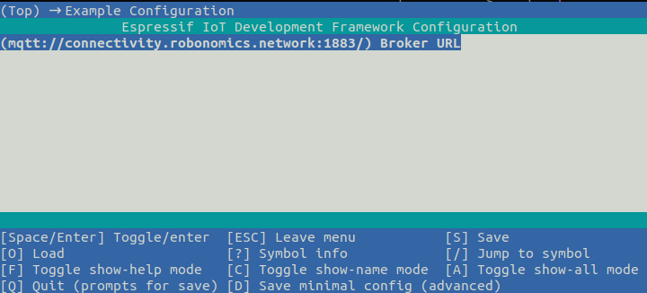

Aquí está la demostración de cómo un microcontrolador que ejecuta [Amazon Web Services FreeRTOS](https://aws.amazon.com/freertos/) puede conectarse a la red Robonomics a través de MQTT. Por favor, consulta [este repositorio](http://github.com/khssnv/freertos_mqtt_robonomics_example) para obtener el código fuente del proyecto.

Utilizamos [ESP32 DevKitC](https://devices.amazonaws.com/detail/a3G0L00000AANtjUAH/ESP32-WROOM-32-DevKitC/) con la distribución FreeRTOS y la implementación MQTT proporcionada por [Espressif IoT Development Framework](https://github.com/espressif/esp-idf), mientras que Espressif es un proveedor del microcontrolador utilizado.

También hay un sensor [PMS-3003](http://www.plantower.com/en/content/?107.html) con fines de demostración. El sensor mide la presencia de partículas en el aire y se puede utilizar para estimar la calidad del aire.

La calidad del aire no es el tema del artículo, puedes encontrar más información al respecto en el sitio web de la OMS: [Contaminación del aire ambiente (exterior)](https://www.who.int/news-room/fact-sheets/detail/ambient-(outdoor)-air-quality-and-health). El objetivo del sistema es publicar las mediciones del sensor en la red Robonomics de Airalab.

## Configuración de hardware

Conectamos el PIN5 de TXD de PMS3003 a IO17 de ESP32 DevKitC para transferir las mediciones mediante UART.
Ambos dispositivos también requieren alimentación y tierra común.


## Flujo de datos

Para enviar las mediciones del sensor a la red Robonomics, nuestro objetivo a nivel de firmware es obtener los datos de un sensor mediante el protocolo de comunicación integrado que admite (UART en nuestro caso) y enviarlo a una instancia de AIRA mediante MQTT / TCP.


En nuestro ejemplo, utilizamos la implementación en la nube de AIRA disponible mediante una dirección IP pública y un nombre de dominio asignado.
En la instancia de AIRA, configuramos el broker MQTT `mosquitto` y nos suscribimos al tema `/freertos_mqtt_robonomics_example/98:F4:AB:72:23:C4` para recibir mensajes de MQTT.

Luego, pasamos los mensajes al escritor `robonomics io` mediante una tubería.


Ahora los datos están disponibles en la red Robonomics y podemos leerlos nuevamente con `robonomics io`.

## Firmware

Utilizamos la aplicación de ejemplo [ESP-MQTT con transporte TCP](https://github.com/espressif/esp-idf/tree/master/examples/protocols/mqtt/tcp) como base.

Solo modificamos `main/app_main.c` para la conexión UART al sensor, la sincronización horaria SNTP y la rutina periódica de publicación MQTT.

Si estás intentando repetir el proyecto y es tu primer proyecto basado en ESP IDF, por favor, sigue primero la guía de programación de ESP-IDF de [Espressif](https://docs.espressif.com/projects/esp-idf/en/latest/esp32/get-started/index.html#installation-step-by-step) para familiarizarte con las operaciones del firmware, como la configuración, compilación y carga con la herramienta `idf.py`.

### Configuración de Wi-Fi

Para comunicarse con la instancia de AIRA implementada en la nube, nuestro microcontrolador requiere una conexión a Internet.
Utilizamos el Wi-Fi del ESP32 para ello.
Espressif proporciona utilidades para configurar el Wi-Fi incorporado.
En nuestro ejemplo, utilizamos un entorno de desarrollo con Ubuntu 20.04 GNU/Linux.
Para configurar el Wi-Fi, vamos a la carpeta del proyecto y ejecutamos la herramienta de configuración del SDK.

```console
cd freertos_mqtt_robonomics_example/firmware
idf.py menuconfig
```

Luego configuramos el SSID y la contraseña del punto de acceso Wi-Fi en la sección `Example Conectarion Configuración`.



### Configuración del punto final MQTT

Hay dos cosas que configurar para MQTT.
La primera es la dirección del broker MQTT.
Se puede configurar con la herramienta de configuración del SDK.

```console
cd freertos_mqtt_robonomics_example/firmware
idf.py menuconfig
```

Establece la `URL del broker` en la sección `Example Configuración`.



La segunda cosa es el tema MQTT.
Lo configuramos en el firmware con el prefijo del nombre del proyecto seguido de la dirección MAC de nuestro ESP32.
Esto nos da `/freertos_mqtt_robonomics_example/98:F4:AB:72:23:C4` para nuestro microchip en particular.

## De MQTT a Robonomics

Primero, comprobemos si recibimos datos por MQTT.
Podemos suscribirnos al tema del broker MQTT de Mosquitto al que el dispositivo publica.

```console
$ nix-shell -p mosquitto --run "mosquitto_sub -h localhost -t '/freertos_mqtt_robonomics_example/98:F4:AB:72:23:C4'"
ts=1615651809, PM1=2, PM2.5=6, PM10=3
```

Aquí traemos el paquete `mosquitto` a nuestro entorno para usar la utilidad `mosquitto_sub`.
Luego nos suscribimos al tema establecido en el firmware.
Obtuvimos nuestras mediciones, lo que significa que AIRA recibe datos correctamente a través de MQTT.
Ahora vamos a enviar estos mensajes a la Red Robonomics.

```console
nix-shell -p mosquitto --run "mosquitto_sub -h localhost -t '/freertos_mqtt_robonomics_example/98:F4:AB:72:23:C4'" | robonomics io write pubsub --bootnodes=/ip4/127.0.0.1/tcp/34333 /freertos_mqtt_robonomics_example
```

Aquí usamos la utilidad `robonomics` para publicar mensajes en el canal pubsub `/freertos_mqtt_robonomics_example`.
Especificamos `bootnodes` para asegurar al menos una conexión establecida.

Ahora estamos leyendo estos mensajes desde el mismo canal pubsub.

```console
$ robonomics io read pubsub --listen /ip4/127.0.0.1/tcp/34333 /freertos_mqtt_robonomics_example
2021-03-27 15:15:51  Generated random peer id: 12D3KooWB2nym5E6c3aPpnPKK5wB9Z6n9eZzcXSpyUBozxhi6dam
2021-03-27 15:15:51  Subscribed to topic: _robonomics_pubsub_peer_discovery
2021-03-27 15:15:51  Subscribed to topic: /freertos_mqtt_robonomics_example
2021-03-27 15:15:56  New peer connected: PeerId("12D3KooWRPLCioD2b9XLZTZJQELSAuQAyTrHUKzRktrQHtTSs6kS")
2021-03-27 15:15:56  GRAFT: Mesh link added for peer: PeerId("12D3KooWRPLCioD2b9XLZTZJQELSAuQAyTrHUKzRktrQHtTSs6kS") in topic: TopicHash { hash: "_robonomics_pubsub_peer_discovery" }
ts=1616843855, PM1=3, PM2.5=4, PM10=3
```

## Recursos originales utilizados

* Esquema de pines ESP32 DevKitC de GoJimmy's blog https://gojimmypi.blogspot.com/2017/03/jtag-debugging-for-esp32.html
* Estructura de datos y decodificador PSM3003 de OpenAirProject https://github.com/openairproject/sensor-esp32

**¡Gracias a todos!**
