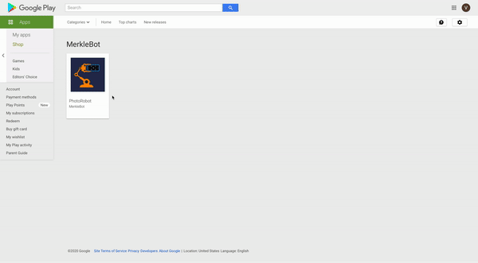

Las tecnologías de Robonomics ya pueden resolver los desafíos a los que se enfrenta la Industria 4.0 y ya se aplican en escenarios del mundo real en el entorno industrial.

Un gran número de empresas de inteligencia artificial están desarrollando soluciones para optimizar los procesos en el suelo de fábrica, permitiendo a las plantas producir más con menos coste. Sin embargo, la mayoría de las plantas dudan en conectar su infraestructura directamente a la nube, ya que esto resulta en posibles riesgos de ciberseguridad, que podrían llevar a pérdidas millonarias e incluso a la pérdida de vidas humanas.

[MerkleBot](https://merklebot.com) ha utilizado [Robonomics Network](https://robonomics.network) para desarrollar una solución para clientes industriales que les permite conectar su fábrica a la inteligencia artificial basada en la nube de forma segura.

Este artículo se escribe a raíz de un experimento que realizamos con [Veracity Protocol](https://www.veracityprotocol.org/) que utiliza algoritmos para crear una protección no invasiva de cualquier objeto físico basada en las fotografías de un dispositivo móvil.

Este caso de uso muestra el proceso de escaneo de las piezas industriales utilizando un brazo robótico.

[Demo video](https://youtu.be/8AL70LFVX5w)

## Proceso paso a paso

### DApp como interfaz de usuario

<!--  -->
<!--  -->
<robo-wiki-picture src="google-play-store.gif" />

DApp actúa como una interfaz de usuario para el operador. Se utiliza para solicitar el lanzamiento del robot para recopilar las fotografías y su objetivo es permitir una comunicación segura entre el entorno de la fábrica y la inteligencia artificial basada en la nube.

### Lanzamiento del robot

<!--  -->
<!--  -->
<robo-wiki-picture src="Veracity_Protocol_Transaction.gif" />

El operador lanza el escaneo robótico firmando la transacción en la DApp. Este paso garantiza que el proceso en el suelo de fábrica solo pueda comenzar en función de la transacción en la cadena de bloques pública.

El robot recibe un comando de la cadena de bloques a través de la Red Robonomics y comienza el escaneo. Las tecnologías de la Red Robonomics nos permiten cerrar la brecha entre el objetivo empresarial y la operación robótica.

### Recopilación de datos y envío a la inteligencia artificial basada en la nube

En la DApp, el operador ve la confirmación y el robot comienza a escanear los objetos colocados en la mesa, como en este caso de uso, o directamente en la línea de fábrica si es necesario.

<!--  -->
<!--  -->
<robo-wiki-picture src="Veracity_Protocol_Launch.gif" />

Cuando el robot recopila los datos, los almacena localmente y los pone a disposición de la inteligencia artificial basada en la nube a través del protocolo IPFS. Al encriptar los datos y organizar el intercambio de datos a través de una transacción en la cadena de bloques, podemos autorizar el acceso a la inteligencia artificial basada en la nube asegurándonos de que los datos permanezcan seguros y en su lugar.

El mecanismo de seguridad incorporado en Robonomics basado en la seguridad compartida de las cadenas de bloques públicas permite obtener el nivel de seguridad que resulta prohibitivamente caro para la mayoría de las fábricas organizar por sí mismas.

### Creación de pasaporte digital

Cuando la inteligencia artificial basada en la nube analiza los datos, el archivo de registro y las recomendaciones se registran automáticamente como un [Pasaporte Digital](https://wiki.robonomics.network/docs/create-digital-identity-run-by-ethereum/). Cada operación y escaneo se pueden rastrear ya que el registro de la cadena de bloques tiene el hash de todos estos archivos a través del protocolo IPFS.

## Comentarios sobre el caso de uso

En este caso de uso, se utilizó el brazo industrial Universal Robot UR3. Pero gracias al soporte de Robonomics para ROS, se pueden utilizar y conectar de forma segura la mayoría de los principales manipuladores industriales, incluidos KUKA, Fanuc y Yaskawa.

Si estás interesado en obtener más información sobre la implementación e integración de instrumentos de inteligencia artificial basados en la nube de forma segura, por favor [contáctanos](mailto:v@merklebot.com)
