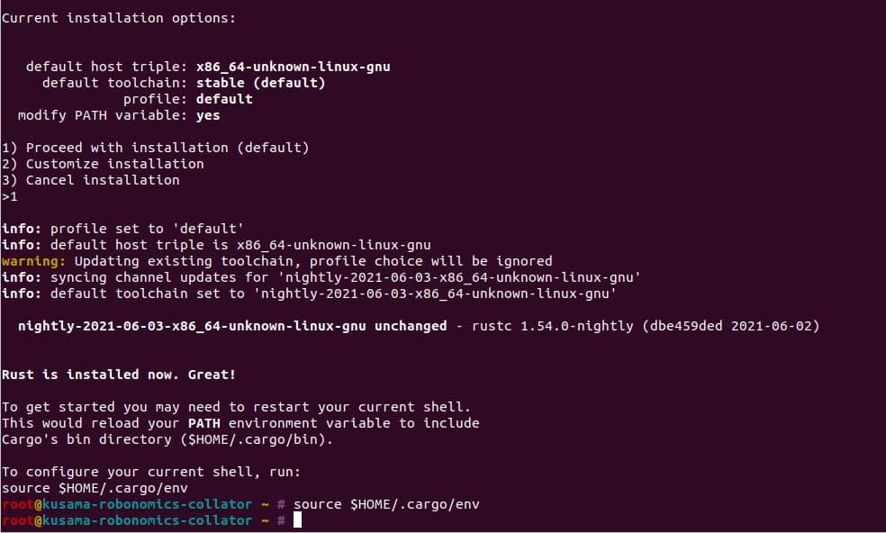

<robo-wiki-note type="note" title="Note">
  Nello screencast e negli screenshot di questo articolo, abbiamo utilizzato la versione 1.4.0 di Robonomics. È necessario utilizzare gli stessi comandi, ma sostituire la versione di Robonomics con quella attuale.
</robo-wiki-note>

## Cos'è un collator

Il collator fa parte della parachain di Robonomics. Questo tipo di nodo crea nuovi blocchi per la catena.

>I collator mantengono le parachain raccogliendo le transazioni delle parachain dagli utenti e producendo prove di transizione di stato per i validatori della Relay Chain. In altre parole, i collator mantengono le parachain aggregando le transazioni delle parachain in candidati di blocco delle parachain e producendo prove di transizione di stato per i validatori basate su quei blocchi.

Puoi saperne di più sul collator nella pagina wiki correlata di [Polkadot](https://wiki.polkadot.network/docs/learn-collator)

Dans la parachain Robonomics, chaque assembleur reçoit des récompenses (**0,000380520 XRT**) pour chaque bloc qu'il a construit, si ce bloc a été scellé à la chaîne.
L'assembleur bénéficie également de **50 % de frais de transaction** sur ce bloc.

## Processo di costruzione

https://youtu.be/wnAtD7w0Pxk

Assicurati di avere Rust e il software di supporto installati. L'installatore di Rust ti chiederà le opzioni di installazione attuali, dovresti scegliere l'opzione `1) Procedi con l'installazione (predefinito)`.


```
  curl https://sh.rustup.rs -sSf | sh
  # on Windows download and run rustup-init.exe
  # from https://rustup.rs instead
  source $HOME/.cargo/env
```



Installa la toolchain notturna richiesta e il target wasm.
I comandi successivi sono validi per Robonomics v2.6.0:

```
  rustup install nightly-2022-08-05
```


```
  rustup default nightly-2022-08-05
  rustup target add wasm32-unknown-unknown --toolchain nightly-2022-08-05
```
Dovrai anche installare i seguenti pacchetti:

  1. Linux:

  ```
    sudo apt install cmake git clang libclang-dev
  ```
  2. Mac:

  ```
    brew install cmake pkg-config git llvm
  ```
  3. Windows (PowerShell):

  ```
    # Install git https://git-scm.com/download/win
    # Install LLVM
    # Download and install the Pre Build Windows binaries
    # of LLVM  from http://releases.llvm.org/download.html
  ```
Ora puoi installare il nodo robonomics dalla sorgente git.

```
  cargo install --force --git https://github.com/airalab/robonomics --tag v2.6.0 robonomics-node
```


Dopo questo comando, il binario robonomics compilato sarà nella directory `~/.cargo/bin`.

Il passo successivo è come avviare il nodo collator. Puoi leggere al riguardo nell'articolo ["Come avviare il collator Robonomics"](/docs/how-to-launch-the-robonomics-collator).