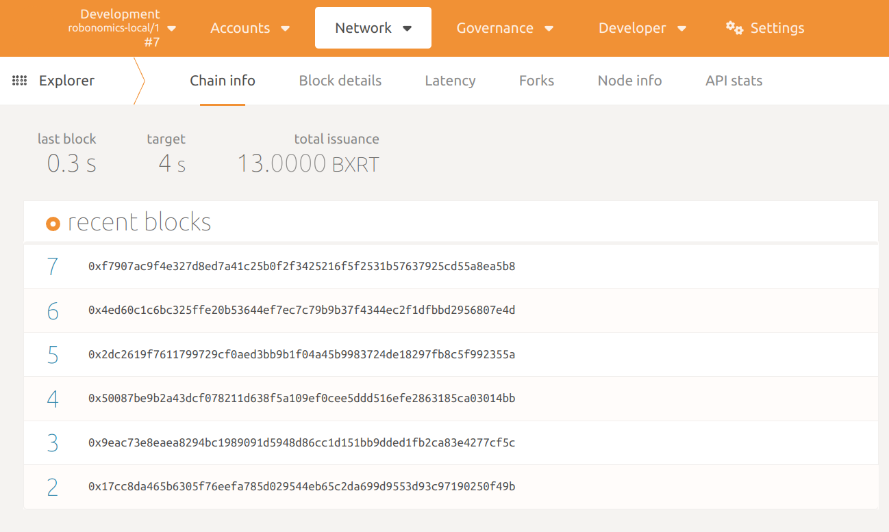

**Per testare le tue applicazioni su Robonomics potresti volerlo eseguire in modalità di sviluppo. Questo articolo mostra passo dopo passo
istruzioni su come ottenere la tua istanza di test locale di Robonomics.**


## Ottieni il file binario del nodo

1. Prima di tutto, hai bisogno di un file binario, scarica l'archivio da [release](https://github.com/airalab/robonomics/releases) più recente.

2. Vai alla cartella dell'archivio, decomprimi il binario e cambia i permessi:

```bash
tar xf robonomics-2.4.0-x86_64-unknown-linux-gnu.tar.gz
chmod +x robonomics
```

## Esegui

Esegui il nodo con:

```bash
./robonomics --dev
```
Vedrai il seguente output:


<robo-wiki-note type="note" title="From Scratch">

  Se desideri eliminare i blocchi esistenti, puoi farlo rimuovendo RocksDB in `/tmp/substrate******/chains/dev/db/full`.
  Sostituisci `******` con un identificatore corrispondente visualizzato nei log all'avvio.

  Se desideri avviare il nodo da zero ogni volta, utilizza l'opzione `--tmp`.

</robo-wiki-note>

## Connetti

Ora puoi connetterti al tuo nodo locale tramite il [Portale Polkadot](https://polkadot.js.org/apps/#/explorer).

Cambia la rete in `Locale Node` nell'angolo in alto a sinistra e premi `Switch`.


Benvenuto nell'istanza locale di Robonomics!




