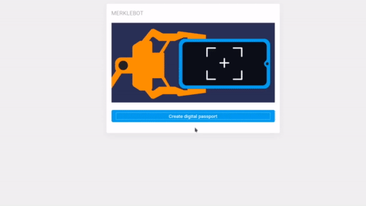

Le tecnologie Robonomics possono già risolvere le sfide che l'Industria 4.0 affronta e sono già applicate a scenari reali nell'ambiente industriale.

Un gran numero di aziende di intelligenza artificiale sta costruendo soluzioni per ottimizzare i processi sul piano di lavoro della fabbrica, consentendo alle piante di produrre di più a costi inferiori. Tuttavia, la maggior parte delle piante è riluttante a collegare la propria infrastruttura direttamente al cloud poiché ciò comporta potenziali rischi per la sicurezza informatica, che potrebbero portare a perdite di milioni di dollari e persino alla perdita di vite umane.

[MerkleBot](https://merklebot.com) ha utilizzato [Robonomics Network](https://robonomics.network) per creare una soluzione per i clienti industriali per collegare la loro fabbrica all'IA basata su cloud in modo sicuro.

Questo articolo è scritto in seguito a un esperimento che abbiamo condotto con [Veracity Protocol](https://www.veracityprotocol.org/) che utilizza algoritmi per creare una protezione non invasiva di qualsiasi oggetto fisico basata sulle fotografie da un dispositivo mobile.

Questo caso d'uso mostra il processo di scansione delle parti industriali utilizzando un braccio robotico.

[Demo video](https://youtu.be/8AL70LFVX5w)

## Processo passo-passo

### DApp come interfaccia utente

<!--  -->
<!--  -->
<robo-wiki-picture src="google-play-store.gif" />

DApp funge da interfaccia utente per l'operatore. Viene utilizzata per richiedere l'avvio del robot per raccogliere le fotografie e il suo scopo è consentire una comunicazione sicura tra l'ambiente della fabbrica e l'IA basata su cloud.

### Avvio del robot

<!--  -->
<!--  -->
<robo-wiki-picture src="Veracity_Protocol_Transaction.gif" />

L'operatore avvia la scansione robotica firmando la transazione nella DApp. Questo passaggio garantisce che il processo sul piano di lavoro della fabbrica possa iniziare solo in base alla transazione nel blockchain pubblico.

Il robot riceve un comando dal blockchain tramite la rete Robonomics e inizia la scansione. Le tecnologie della rete Robonomics ci consentono di colmare il divario tra l'obiettivo aziendale e l'operazione robotica.

### Raccolta dati e invio all'IA basata su cloud

Nella DApp l'operatore vede la conferma e il robot inizia a scansionare gli oggetti posizionati sul tavolo, come in questo caso d'uso, o direttamente sulla linea di produzione della fabbrica se necessario.

<!--  -->
<!--  -->
<robo-wiki-picture src="Veracity_Protocol_Launch.gif" />

Quando il robot raccoglie i dati, li memorizza localmente e li rende disponibili all'IA basata su cloud tramite il protocollo IPFS. Crittografando i dati e organizzando lo scambio di dati tramite una transazione blockchain, possiamo autorizzare l'accesso all'IA basata su cloud garantendo al contempo la sicurezza e l'integrità dei dati.

Il meccanismo di sicurezza integrato in Robonomics basato sulla sicurezza condivisa dei blockchain pubblici consente di ottenere un livello di sicurezza che risulta proibitivamente costoso per la maggior parte delle fabbriche organizzare autonomamente.

### Creazione di un passaporto digitale

Quando l'IA basata su cloud analizza i dati, il file di registro e le raccomandazioni vengono registrati automaticamente come un [Passaporto Digitale](https://wiki.robonomics.network/docs/create-digital-identity-run-by-ethereum/). Ogni operazione e scansione possono essere rintracciate poiché il record del blockchain ha l'hash di tutti questi file tramite il protocollo IPFS.

## Commenti sul caso d'uso

In questo caso d'uso è stato utilizzato il braccio industriale Universal Robot UR3. Ma grazie al supporto di Robonomics per ROS, la maggior parte dei principali manipolatori industriali può essere utilizzata e collegata in modo sicuro all'IA basata su cloud, inclusi KUKA, Fanuc e Yaskawa.

Se sei interessato a saperne di più sull'implementazione e l'integrazione di strumenti di intelligenza artificiale basati su cloud in modo sicuro, ti preghiamo di [contattarci](mailto:v@merklebot.com)
