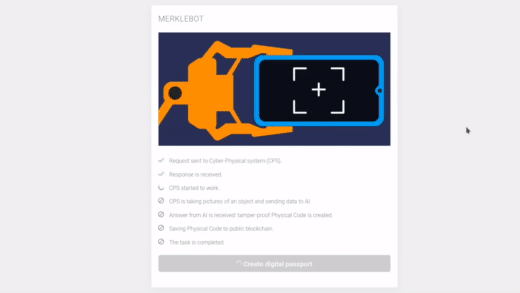

As tecnologias Robonomics já podem resolver os desafios enfrentados pela Indústria 4.0 e já estão sendo aplicadas em cenários do mundo real no ambiente industrial.

Um grande número de empresas de IA está construindo soluções para otimizar os processos no cho de fábrica, permitindo que as plantas produzam mais com menos custo. No entanto, a maioria das plantas reluta em conectar sua infraestrutura à nuvem diretamente, pois isso resulta em riscos potenciais de segurança cibernética, que podem levar a perdas de milhões de dólares e até mesmo à perda de vidas humanas.

[MerkleBot](https://merklebot.com) usou [Robonomics Network](https://robonomics.network) para construir uma solução para clientes industriais conectarem sua fábrica à IA baseada em nuvem de forma segura.

Este artigo é escrito após um experimento que conduzimos com o [Veracity Protocol](https://www.veracityprotocol.org/) que usa algoritmos para criar proteção não invasiva de qualquer item físico com base nas fotografias de um dispositivo móvel.

Este caso de uso mostra o processo de digitalização das peças industriais usando um braço robótico.

[Demo video](https://youtu.be/8AL70LFVX5w)

## Processo passo a passo

### DApp como interface do usuário

<!--  -->
<!--  -->
<robo-wiki-picture src="google-play-store.gif" />

DApp atua como uma interface do usuário para o operador. É usado para solicitar o lançamento do robô para coletar as fotografias e seu objetivo é permitir a comunicação segura entre o ambiente da fábrica e a IA baseada em nuvem.

### Lançando o robô

<!--  -->
<!--  -->
<robo-wiki-picture src="Veracity_Protocol_Transaction.gif" />

O operador inicia a digitalização robótica assinando a transação no DApp. Esta etapa garante que o processo no chão de fábrica só possa começar com base na transação no blockchain público.

O robô recebe um comando do blockchain através da Robonomics Network e inicia a digitalização. As tecnologias da Robonomics Network nos permitem fechar a lacuna entre o objetivo comercial e a operação robótica.

### Coleta de dados e envio para IA baseada em nuvem

No DApp, o operador vê a confirmação e o robô começa a digitalizar os itens colocados na mesa, como neste caso de uso, ou diretamente na linha de produção da fábrica, se necessário.

<!--  -->
<!--  -->
<robo-wiki-picture src="Veracity_Protocol_Launch.gif" />

Quando o robô coleta os dados, ele os armazena localmente e os disponibiliza para a IA baseada em nuvem através do protocolo IPFS. Ao criptografar os dados e organizar a troca de dados por meio de uma transação blockchain, podemos autorizar o acesso à IA baseada em nuvem, garantindo que os dados permaneçam seguros e no local.

O mecanismo de segurança incorporado à Robonomics, com base na segurança compartilhada de blockchains públicos, permite obter o nível de segurança que é proibitivamente caro para a maioria das fábricas organizarem por conta própria.

### Criação de passaporte digital

Quando a IA baseada em nuvem analisa os dados, o arquivo de log e as recomendações são registrados automaticamente como um [Passaporte Digital](https://wiki.robonomics.network/docs/create-digital-identity-run-by-ethereum/). Cada operação e digitalização podem ser rastreadas, pois o registro blockchain possui o hash de todos esses arquivos através do protocolo IPFS.

## Comentários sobre o caso de uso

Neste caso de uso, foi utilizado o braço industrial Universal Robot UR3. Mas, graças ao suporte da Robonomics para ROS, a maioria dos principais manipuladores industriais pode ser usada e conectada à IA baseada em nuvem de forma segura, incluindo KUKA, Fanuc e Yaskawa.

Se você estiver interessado em saber mais sobre a implantação e integração de instrumentos de IA baseados em nuvem de forma segura, entre em contato pelo [e-mail](mailto:v@merklebot.com)
