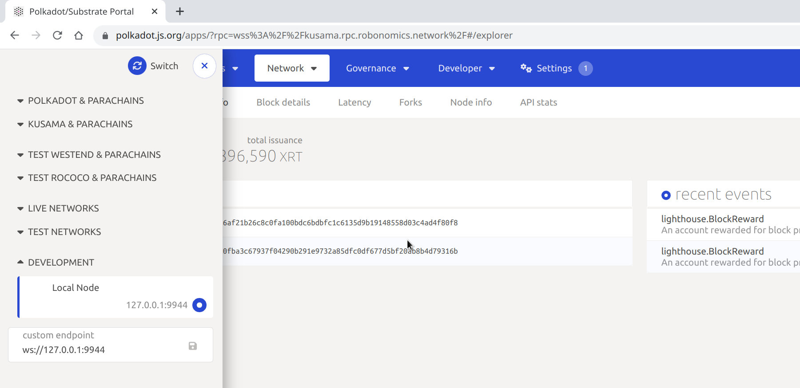

** Для тестування ваших додатків на Robonomics ви можете запустити його в режимі розробника. Ця стаття показує крок за кроком
інструкції, як отримати власний локальний тестовий екземпляр Robonomics. **


## Отримати бінарний вузол

1. Спочатку вам потрібен бінарний файл, завантажте архів з ним з останнього [релізу](https://github.com/airalab/robonomics/releases).

2. Перейдіть до папки з архівом, розпакуйте бінарний файл і змініть дозволи:

```bash
tar xf robonomics-2.4.0-x86_64-unknown-linux-gnu.tar.gz
chmod +x robonomics
```

## Запустити

Запустіть вузол з:

```bash
./robonomics --dev
```
Ви побачите наступний вивід:


<robo-wiki-note type="note" title="From Scratch">

  Якщо ви хочете очистити існуючі блоки, ви можете зробити це, видаливши RocksDB за адресою `/tmp/substrate******/chains/dev/db/full`.
  Замініть `******` на відповідний ідентифікатор, відображений у журналах при запуску.

  Якщо ви хочете кожного разу запускати вузол з нуля, використовуйте прапорець `--tmp`.

</robo-wiki-note>

## Підключитися

Тепер ви можете підключитися до свого локального вузла через [Polkadot Portal](https://polkadot.js.org/apps/#/explorer).

Змініть мережу на `Local Node` в верхньому лівому куті та натисніть `Switch`.



Ласкаво просимо до локального екземпляра Robonomics!


