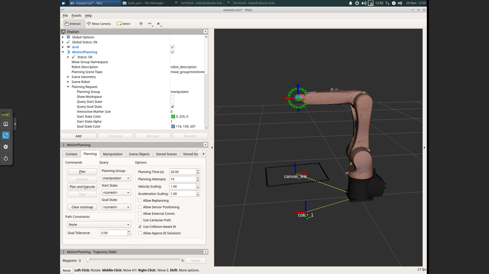

https://www.youtube.com/watch?v=GxlYxaykqTU

**在本文中，我们将通过一些安装和启动步骤来设置一个机器人画家。要求：**
- KUKA KR6 R900 sixx与KRC4和SmartPad；
- 已安装[ROS melodic](http://wiki.ros.org/melodic/安装ation/Ubuntu)的Intel NUC；
- 桌子、油漆、刷子、水。

## 在KRC4上安装件
KRC4和NUC都需要EKI接口。有关如何在KRC4上设置它的详细信息，请参见[此处](https://github.com/AlexeiOvcharov/kuka_experimental/tree/a915bf4e932990379c84164713e7ae11a24a2a13/kuka_eki_hw_interface/krl)。在机器人控制器上启动它。

## 在NUC上安装软件
创建一个catkin工作空间：
```
mkdir -p ~/catkin_ws/src
cd ~/catkin_ws/
catkin build
```
下载ROS软件包。所有脚本都存储在[这里](https://github.com/airalab/robot_painter/tree/test_branch)。克隆存储库：
```
cd src
git clone --branch test_branch https://github.com/airalab/robot_painter
cd robot_painter
rm -rf scenes
mv * ../
cd ..
rmdir robot_painter
```
您可能需要一些头文件和库来使其正常工作。下载它们：
```
cd ~
git clone https://github.com/PaTara43/kuka_moveit_webots
cd kuka_moveit_webots
sudo mv -r headers/* usr/include/c++/7/
sudo mv libs/* usr/local/lib/
cd ~
svn checkout https://github.com/PX4/Matrix/trunk/matrix
mv matrix -r /usr/include/c++/7/
sudo apt-get install ros-melodic-brics-actuator
cd ~/catkin_ws
catkin build
```
将源命令添加到`.bashrc`文件中：
```
echo “source ~/catkin_ws/devel/setup.bash” >> ~/.bashrc
source ~/.bashrc
```
到目前为止，您应该能够启动脚本。如果出现问题，请尝试一些[故障排除](https://github.com/airalab/robot_painter/issues)

## 填写常量
首先，机器人需要知道画布的位置和方向，以及油漆罐的位置。所有这些都在`fake_painter_enviroment_tf/src/tf_broadcaster.cpp`中指定。让我们来看看它。
```
// Plane constants
const double A = -0.0641;
const double B = 0.0214;
const double C = 0.9977;
const double D = -0.2198;

// Canvas transform
const double px = 0.52;
const double py = -0.24;
const double qx = -0.011;
const double qy = -0.032;
const double qz = 0.0;
const double qw = 0.999;
```
这些是指定画布在3D空间中位置的平面方程常量。它们在下面描述的校准过程中获得。接下来是油漆。
```
colorTransform.transform.translation.x = 0.5;
colorTransform.transform.translation.y = 0.2;
colorTransform.transform.translation.z = 0.258;
```
这些是油漆罐的坐标。它们也可以在校准过程中指定。画布大小在
```
canvas.width = 0.5;
canvas.height = 0.4;
```
还有一些重要的常量存储在`local_task_planner/src/Drawing.cpp`中：
```
const double COLOR_BOTLE_HEIGHT = 0.06;
const double COLOR_HEIGHT = 0.045;
const double HEIGHT_OFFSET = COLOR_BOTLE_HEIGHT - COLOR_HEIGHT + 0.02;
const double BRUSH_HEIGHT = 0.01;
const double BRUSH_WIDTH = 0.01;
```
它们的名称说明了一切，根据情况填写它们。

## 校准Gaka-Chu
校准过程本身非常简单。

1）在KRC4上启动EKI接口：

以'AUT'模式登录，打开驱动程序并启动脚本`eki_hw_interface`

2）在NUC上启动EKI接口
```
roslaunch kuka_eki_hw_interface test_hardware_interface.launch
```
它应该输出无尽的日志。

3）启动RViz
```
roslaunch kuka_moveit_config demo.launch
```
您应该看到以下内容：


尝试移动末端执行器并点击'Plan and Execute'。机器人应该移动。在SmartPad上转到**Display -> Actual position**并观察末端执行器的坐标。将画布水平放置在机器人底座上。将刷子插入刷子架并小心地移动它，直到它轻轻触碰画布。在此位置保存末端执行器的坐标。重复12-15次。还要保存画布中心和油漆罐的坐标。
当您有一组坐标时，使用[这些](https://github.com/nakata5321/Matlab_scripts_gaka-chu) Matlab脚本解析缺失的常量和四元数。粘贴它们。使用
```
cd ~/catkin_workspace
rm -rf build logs devel
catkin build
```

## 测试Gaka-Chu校准
校准后，需要通过绘制画布边框来测试Gaka-Chu。要执行每个命令，请在新终端中执行：
```
roslaunch kuka_eki_hw_interface test_hardware_interface.launch
roslaunch kuka_moveit_config demo.launch
rosrun fake_painter_enviroment_tf tf_broadcaster
rosrun local_task_planner draw_workspace
```
之后，您应该在RViz中看到一个画布轮廓：



在终端中按下"S"进行测试。机器人的末端执行器应该在画布边框的正上方移动，刷子在整个运动过程中应该轻轻触碰画布。如果不是这样，请尝试重新校准。如果画布模型旋转错误，您可以通过在Matlab中更改四元数来旋转它。

## 创作艺术
您需要6个基本模块才能使其正常工作：
- EKI接口；
- MOVEit + RViz;
- 环境框架广播；
- 图片转换服务；
- 轨迹绘制模块；
- 启动触发器。

让我们逐个启动它们。

### Eki接口
在KRC4上启动`eki_hw_interface`，在NUC上在新终端中执行：
```
roslaunch kuka_eki_hw_interface test_hardware_interface.launch
```

### RViz和MOVEit
您需要一个规划器和一个仿真。使用以下命令启动它们：
```
roslaunch kuka_moveit_config demo.launch
```

### 环境
告诉机器人油漆罐和画布的位置。请注意，不需要启动`draw workspace`节点，`tf_broadcaster`共享画布大小。它只是在RViz中不显示。
```
rosrun fake_painter_enviroment_tf tf_broadcaster
```

### 图片处理器
所有传入的图片都需要进行处理。启动服务。
```
rosrun picture_preprocessing TextConverter.py
```
当它接收到呼叫时，它会使用HP滤镜处理图片并创建一个包含轨迹的rosbag文件。

### 轨迹绘制器
这里最主要的脚本就是轨迹绘制器本身。它等待图片，调用TextConverter服务并绘制画作。
```
rosrun local_task_planner trajectory_drawing
```

## 发送一张图片给机器人进行绘制
机器人监听一个特定的ROS主，您需要传递一个所需图片的路径。图片应为正方形（宽度等于高度），由线条组成。发送路径：
```
rostopic pub /run std_msgs/String "data: '<path_to_picture>'"
```
之后，会弹出两个窗口显示轮廓和轨迹。关闭它们，然后观看Gaka-Chu的绘画。请注意安全，并随时准备按下紧急停止按钮。
当Gaka-Chu完成他的艺术作品后，您可以发送另一个图片路径，画家将重复整个过程。
