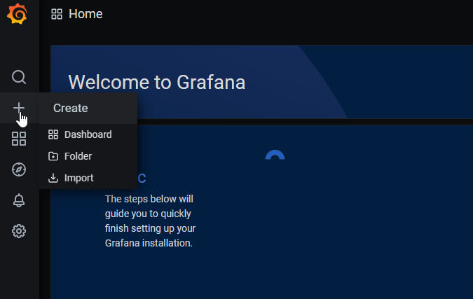

**以下指令由[Hubo Bubo](https://github.com/hubobubo)提供**

**原始文章位于[此处](https://github.com/hubobubo/robonomics/wiki/Robonomics-(XRT)-metrics-using-Prometheus-and-Grafana)**

## 介绍
为了更好地监控和维护Robonomics节点，建议使用基于Prometheus Server和Grafana的监控系统。本文将展示如何配置这两个工具以完全监控您的节点。

##  先决条件
* [使用Ubuntu 18.04进行服务器设置](https://www.digitalocean.com/community/tutorials/initial-server-setup-with-ubuntu-18-04) 
* [已安装Robonomics parachain collator](https://blog.aira.life/installing-and-running-the-robonomics-validator-in-the-polkadot-network-487ad4c1a567)
* 确保您的机器上已经运行了robonomics.service，并且端口9615是可访问的 

## 第一步 - 创建服务用户

出于安全考虑，我们将首先创建两个新的用户账户，即prometheus和node_exporter。创建这两个用户，并使用“--no-create-home”和“--shell /bin/false”选项，以防止这些用户登录到服务器。
```
sudo useradd --no-create-home --shell /bin/false prometheus
sudo useradd --no-create-home --shell /bin/false node_exporter
```

在下载Prometheus二进制文件之前，创建用于存储Prometheus文件和数据的必要目录。按照标准的Linux约定，我们将在/etc目录中创建一个目录用于存储Prometheus的配置文件，并在/var/lib目录中创建一个目录用于存储其数据。
```
sudo mkdir /etc/prometheus
sudo mkdir /var/lib/prometheus
```
现在，将新目录上的用户和组所有权设置为prometheus用户。
```
sudo chown prometheus:prometheus /etc/prometheus
sudo chown prometheus:prometheus /var/lib/prometheus
```
## 第二步 - 下载Prometheus

首先，下载并解压缩当前稳定版本的Prometheus到您的主目录。您可以在[Prometheus下载页面](https://prometheus.io/download/)上找到最新的二进制文件。

```
wget https://github.com/prometheus/prometheus/releases/download/v2.21.0/prometheus-2.21.0.linux-amd64.tar.gz

```
现在，解压缩下的存档。

```
tar xvf prometheus-2.21.0.linux-amd64.tar.gz

```
这将创建一个名为prometheus-2.21.0.linux-amd64的目录，其中包含两个二进制文件（prometheus和promtool），包含Web界面文件的consoles和console_libraries目录，以及许可证、通知和几个示例文件。

将这两个二进制文件复制到/usr/local/bin目录。

```
sudo cp prometheus-2.21.0.linux-amd64/prometheus /usr/local/bin/
sudo cp prometheus-2.21.0.linux-amd64/promtool /usr/local/bin/

```
将二进制文件上的用户和组所有权设置为第1步中创建的prometheus用户。

```
sudo chown prometheus:prometheus /usr/local/bin/prometheus
sudo chown prometheus:prometheus /usr/local/bin/promtool

```
将consoles和console_libraries目录复制到/etc/prometheus目录。

```
sudo cp -r prometheus-2.21.0.linux-amd64/consoles /etc/prometheus
sudo cp -r prometheus-2.21.0.linux-amd64/console_libraries /etc/prometheus

```
将目录上的用户和组所有权设置为prometheus用户。使用-R标志将确保在目录内部的文件上设置所有权。

```
sudo chown -R prometheus:prometheus /etc/prometheus/consoles
sudo chown -R prometheus:prometheus /etc/prometheus/console_libraries

```
现在，Prometheus已安装，我们将创建其配置和服务文件，以准备进行首次运行。

## 第三步 - 配置Prometheus

在/etc/prometheus目录中，使用nano或您喜欢的文本编辑器创建一个名为prometheus.yml的配置文件。

```
sudo nano /etc/prometheus/prometheus.yml

```
在全局设置中，定义抓取指标的默认间隔。请注意，Prometheus将将这些设置应用于每个导出器，除非单个导出器的自身设置覆盖全局设置。

```
global:
  scrape_interval: 15s

```
这个scrape_interval值告诉Prometheus每15秒从其导出器收集指标，这对于大多数导出器来说足够长。
现在，使用以下scrape_configs指令将Prometheus本身添加到要从中抓取的导出器列表中：

```
...
scrape_configs:
  - job_name: 'prometheus'
    scrape_interval: 5s
    static_configs:
      - targets: ['localhost:9090']
```
Prometheus使用job_name在查询和图形上标记导出器，因此在此处选择一些描述性的内容。

由于Prometheus导出有关自身的重要数据，您可以用于性能监控和调试，因此我们将全局scrape_interval指令从15秒覆盖为5秒，以获得更频繁的更新。

最后，Prometheus使用static_configs和targets指令来确定导出器的运行位置。由于此特定导出器在与Prometheus本身相同的服务器上运行，因此我们可以使用localhost而不是IP地址以及默认端口9090。

您的配置文件现在应该如下所示：

```
global:
  scrape_interval: 15s

scrape_configs:
  - job_name: 'prometheus'
    scrape_interval: 5s
    static_configs:
      - targets: ['localhost:9090']
```
保存文件并退出文本编辑器。

现在，将配置文件上的用户和组所有权设置为第1步中创建的prometheus用户。

```
sudo chown prometheus:prometheus /etc/prometheus/prometheus.yml

```
配置完成后，我们准备通过首次运行来测试Prometheus。

## 第四步 - 运行Prometheus

以prometheus用户身份启动Prometheus，提供配置文件和数据目录的路径。

```
sudo -u prometheus /usr/local/bin/prometheus \
    --config.file /etc/prometheus/prometheus.yml \
    --storage.tsdb.path /var/lib/prometheus/ \
    --web.console.templates=/etc/prometheus/consoles \
    --web.console.libraries=/etc/prometheus/console_libraries
```

输出包含有关Prometheus的加载进度、配置文件和相关服务的信息。它还确认Prometheus正在监听端口9090。

```
_log output_
Sep 14 17:55:53 robonomics systemd[1]: Started Prometheus.
Sep 14 17:55:53 robonomics prometheus[29488]: level=info ts=2020-09-14T15:55:53.347Z caller=main.go:310 msg="No time or size retention was set so using the default time retention" duration=15d
Sep 14 17:55:53 robonomics prometheus[29488]: level=info ts=2020-09-14T15:55:53.350Z caller=main.go:346 msg="Starting Prometheus" version="(version=2.21.0, branch=HEAD, revision=e83ef207b6c2398919b69cd87d2693cfc2fb4127)"
Sep 14 17:55:53 robonomics prometheus[29488]: level=info ts=2020-09-14T15:55:53.351Z caller=main.go:347 build_context="(go=go1.15.2, user=root@a4d9bea8479e, date=20200911-11:35:02)"
Sep 14 17:55:53 robonomics prometheus[29488]: level=info ts=2020-09-14T15:55:53.351Z caller=main.go:348 host_details="(Linux 4.15.0-112-generic #113-Ubuntu SMP Thu Jul 9 23:41:39 UTC 2020 x86_64 robonomics (none))"
Sep 14 17:55:53 robonomics prometheus[29488]: level=info ts=2020-09-14T15:55:53.351Z caller=main.go:349 fd_limits="(soft=1024, hard=4096)"
Sep 14 17:55:53 robonomics prometheus[29488]: level=info ts=2020-09-14T15:55:53.351Z caller=main.go:350 vm_limits="(soft=unlimited, hard=unlimited)"
Sep 14 17:55:53 robonomics prometheus[29488]: level=info ts=2020-09-14T15:55:53.357Z caller=main.go:701 msg="Starting TSDB ..."
Sep 14 17:55:53 robonomics prometheus[29488]: level=info ts=2020-09-14T15:55:53.368Z caller=web.go:523 component=web msg="Start listening for connections" address=0.0.0.0:9090
Sep 14 17:55:53 robonomics prometheus[29488]: level=info ts=2020-09-14T15:55:53.372Z caller=head.go:644 component=tsdb msg="Replaying on-disk memory mappable chunks if any"
Sep 14 17:55:53 robonomics prometheus[29488]: level=info ts=2020-09-14T15:55:53.373Z caller=head.go:658 component=tsdb msg="On-disk memory mappable chunks replay completed" duration=12.659µs
Sep 14 17:55:53 robonomics prometheus[29488]: level=info ts=2020-09-14T15:55:53.373Z caller=head.go:664 component=tsdb msg="Replaying WAL, this may take a while"
Sep 14 17:55:53 robonomics prometheus[29488]: level=info ts=2020-09-14T15:55:53.380Z caller=head.go:716 component=tsdb msg="WAL segment loaded" segment=0 maxSegment=1
Sep 14 17:55:53 robonomics prometheus[29488]: level=info ts=2020-09-14T15:55:53.381Z caller=head.go:716 component=tsdb msg="WAL segment loaded" segment=1 maxSegment=1
Sep 14 17:55:53 robonomics prometheus[29488]: level=info ts=2020-09-14T15:55:53.381Z caller=head.go:719 component=tsdb msg="WAL replay completed" checkpoint_replay_duration=48.125µs wal_replay_duration=8.253748ms total_replay_duration=8.343335ms
Sep 14 17:55:53 robonomics prometheus[29488]: level=info ts=2020-09-14T15:55:53.383Z caller=main.go:721 fs_type=EXT4_SUPER_MAGIC
Sep 14 17:55:53 robonomics prometheus[29488]: level=info ts=2020-09-14T15:55:53.384Z caller=main.go:724 msg="TSDB started"
Sep 14 17:55:53 robonomics prometheus[29488]: level=info ts=2020-09-14T15:55:53.384Z caller=main.go:850 msg="Loading configuration file" filename=/etc/prometheus/prometheus.yml
Sep 14 17:55:53 robonomics prometheus[29488]: level=info ts=2020-09-14T15:55:53.384Z caller=main.go:881 msg="Completed loading of configuration file" filename=/etc/prometheus/prometheus.yml totalDuration=908.135µs remote_storage=6.693µs web_handler=819ns query_engine=1.383µs scrape=400.232µs scrape_sd=41.679µs notify=1.1µs notify_sd=1.847µs rules=1.522µs
Sep 14 17:55:53 robonomics prometheus[29488]: level=info ts=2020-09-14T15:55:53.384Z caller=main.go:673 msg="Server is ready to receive web requests."
```
如果您收到错误消息，请仔细检查您的配置文件中是否使用了YAML语法，然后按照屏幕上的说明解决问题。

现在，按下_CTRL+C_ 停止Prometheus，然后打开一个新的_systemd_服务文件。

```
sudo nano /etc/systemd/system/prometheus.service

```
服务文件告诉_systemd_以prometheus用户身份运行Prometheus，配置文件位于_/etc/prometheus/prometheus.yml_目录中，并将其数据存储在_/var/lib/prometheus_目录中。将以下内容复制到文件中：

```
[Unit]
Description=Prometheus
Wants=network-online.target
After=network-online.target

[Service]
User=prometheus
Group=prometheus
Type=simple
ExecStart=/usr/local/bin/prometheus \
    --config.file /etc/prometheus/prometheus.yml \
    --storage.tsdb.path /var/lib/prometheus/ \
    --web.console.templates=/etc/prometheus/consoles \
    --web.console.libraries=/etc/prometheus/console_libraries

[Install]
WantedBy=multi-user.target
```

最后，保存文件并关闭文本编辑器。要使用新创建的服务，重新加载systemd。

```
sudo systemctl daemon-reload

```
现在，您可以使用以下命令启动Prometheus：

```
sudo systemctl start prometheus

```
为确保Prometheus正在运行，请检查服务的状态。

```
sudo systemctl status prometheus

```
输出会告诉您Prometheus的状态、主进程标识符（PID）、内存使用情况等。

如果服务的状态不是活动状态，请按照屏幕上的说明重新跟踪前面的步骤以解决问题，然后继续教程。

```
* prometheus.service - Prometheus
   Loaded: loaded (/etc/systemd/system/prometheus.service; enabled; vendor preset: enabled)
   Active: active (running) since Mon 2020-09-14 17:59:48 CEST; 24h ago
 Main PID: 29650 (prometheus)
    Tasks: 9 (limit: 4915)
   CGroup: /system.slice/prometheus.service
           `-29650 /usr/local/bin/prometheus --config.file /etc/prometheus/prometheus.yml --storage.tsdb.path /var/lib/prometheus/ --web.console.templates=/etc/prometheus/consoles --web.console.libraries=/etc/prometheus/console_libraries
```

当您准备好继续时，按下_Q_退出状态命令。最后，启用服务以在启动时启动。

```
sudo systemctl enable prometheus

```

现在，Prometheus已经启动并运行，我们可以安装一个额外的导出器来生成有关服务器资源的指标。

## 第5步 - 下载Node Exporter

为了将Prometheus扩展到仅有关自身的指标之外，我们将安装一个名为Node Exporter的额外导出器。Node Exporter提供有关系统的详细信息，包括CPU、磁盘和内存使用情况。将当前稳定版本的Node Exporter下载到您的主目录中。您可以在[Prometheus下载页面](https://prometheus.io/download/)上找到最新的二进制文件。

```
wget https://github.com/prometheus/node_exporter/releases/download/v1.0.1/node_exporter-1.0.1.linux-amd64.tar.gz

```
现在，解压缩下的存档。

```
tar xvf node_exporter-1.0.1.linux-amd64.tar.gz

```
这将创建一个名为_node_exporter-1.0.1.linux-amd64_的目录，其包含一个名为_node_exporter_的二进制文件、一个许可证和一个通知。

将二进制文件复制到_/usr/local/bin_目录，并将用户和组所有权设置为在第1步中创建的node_exporter用户。

```
sudo cp node_exporter-1.0.1.linux-amd64/node_exporter /usr/local/bin
sudo chown node_exporter:node_exporter /usr/local/bin/node_exporter

```
现在，您已经安装了Node Exporter，让我们在创建一个服务文件之前先运行它，以便它在启动时启动。

## 第6步 - 运行Node Exporter

运行Node Exporter的步骤与运行Prometheus本身的步骤类似。首先，为Node Exporter创建Systemd服务文件。

```
sudo nano /etc/systemd/system/node_exporter.service

```
将以下内容复制到服务文件中：

```
[Unit]
Description=Node Exporter
Wants=network-online.target
After=network-online.target

[Service]
User=node_exporter
Group=node_exporter
Type=simple
ExecStart=/usr/local/bin/node_exporter --collector.systemd

[Install]
WantedBy=multi-user.target
```

保存文件并关闭文本编辑器。最后，重新加载systemd以使用新创建的服务。

```
sudo systemctl daemon-reload

```
现在，您可以使用以下命令运行Node Exporter：

```
sudo systemctl start node_exporter

```
验证 that Node Exporter’s running correctly with the status command.

```
sudo systemctl status node_exporter

```
与之前一样，此输出会告诉您Node Exporter的状态、主进程标识符（PID）、内存使用情况等。如果服务的状态不是活动状态，请按照屏幕上的消息重新跟踪前面的步骤以解决问题，然后继续。

```
_Output_
* node_exporter.service - Node Exporter
   Loaded: loaded (/etc/systemd/system/node_exporter.service; enabled; vendor preset: enabled)
   Active: active (running) since Mon 2020-09-14 17:58:25 CEST; 1 day 1h ago
 Main PID: 29612 (node_exporter)
    Tasks: 7 (limit: 4915)
   CGroup: /system.slice/node_exporter.service
           `-29612 /usr/local/bin/node_exporter --collector.systemd
```
最后，启用Node Exporter以在启动时启动。

```
sudo systemctl enable node_exporter

```
配置和运行Node Exporter如预期后，我们将告诉Prometheus开始抓取新的指标。

## 第7步 - 配置Prometheus以抓取Node Exporter

因为Prometheus仅抓取在其配置文件的scrape_configs部分中定义的导出器，所以我们需要为Node Exporter添加一个条目，就像我们为Prometheus本身做的那样。打开配置文件。

```
sudo nano /etc/prometheus/prometheus.yml

```
在scrape_configs块的末尾，添加一个名为node_exporter的新条目。

```
...
  - job_name: 'node_exporter'
    scrape_interval: 5s
    static_configs:
      - targets: ['localhost:9100']
```
因为该导出器也在与Prometheus本身相同的服务器上运行，所以我们可以再次使用localhost，以及Node Exporter的默认端口9100。您的整个配置文件应如下所示：

```
global:
  scrape_interval: 15s

scrape_configs:
  - job_name: 'prometheus'
    scrape_interval: 5s
    static_configs:
      - targets: ['localhost:9090']
  - job_name: 'node_exporter'
    scrape_interval: 5s
    static_configs:
      - targets: ['localhost:9100']
```
当您准备继续时，保存文件并退出文本编辑器。最后，重新启动Prometheus以使更改生效。

```
sudo systemctl restart prometheus

```
再次使用状态命令验证一切是否正常运行。

```
sudo systemctl status prometheus

```
如果服务的状态未设置为活动状态，请按照屏幕上的说明重新跟踪之前的步骤。

```
Output
* prometheus.service - Prometheus
   Loaded: loaded (/etc/systemd/system/prometheus.service; enabled; vendor preset: enabled)
   Active: active (running) since Tue 2020-09-15 19:06:56 CEST; 2s ago
 Main PID: 19725 (prometheus)
    Tasks: 8 (limit: 4915)
   CGroup: /system.slice/prometheus.service
           `-19725 /usr/local/bin/prometheus --config.file /etc/prometheus/prometheus.yml --storage.tsdb.path /var/lib/prometheus/ --web.console.templates=/etc/prometheus/consoles --web.console.libraries=/etc/prometheus/console_libraries
```

现在，我们已经安装、配置和运行了Prometheus和Node Exporter。

## 第8步 - 添加Robonomic内置的node_exporter

在成功安装Prometheus和node_exporter之后，我们将不得不在每个substrate项目中使用内置的prometheus导出器。为此，我们必须向_/etc/prometheus/prometheus.yml_添加附加条目。. 
打开配置文件。

```
sudo nano /etc/prometheus/prometheus.yml

```
在scrape_configs块的末尾，添加一个名为robonomic_exporter的新条目。

``` 
  - job_name: 'robonomics_exporter'
    scrape_interval: 5s
    static_configs:
      - targets: ['localhost:9615']
```
保存文件并退出文本编辑器。您的整个配置文件应该如下所示：

```
global:
  scrape_interval: 15s

scrape_configs:
  - job_name: 'prometheus'
    scrape_interval: 5s
    static_configs:
      - targets: ['localhost:9090']
  - job_name: 'node_exporter'
    scrape_interval: 5s
    static_configs:
      - targets: ['localhost:9100']
  - job_name: 'robonomics_exporter'
    scrape_interval: 5s
    static_configs:
      - targets: ['localhost:9615']
```

最后，重新启动Prometheus以使更改生效。

```
sudo systemctl restart prometheus

```
再次使用状态命令验证一切是否正常运行。

```
sudo systemctl status prometheus

```
我们现在已经安装、配置和运行了_Prometheus_、_Node Exporter_以及_Robonomic Exporter_。现在继续进行Grafana的设置。

## 第9步-设置Grafana

最后一步是在Grafana中将Prometheus连接为数据源。为了本教程的目的，我们将使用免费的基于云的Grafana，它允许最多拥有5个仪表板以及专用的[Robonomics仪表板](https://grafana.com/grafana/dashboards/13015)。只需转到[grafana.com](https://grafana.com/)创建新帐户并登录到您新创建的Grafana实例。

首先，我们必须向Grafana添加新的_**数据源**_，在我们的情况下将是Prometheus服务器。
转到数据源：

>

然后点击**_添加数据源_**

>

接下来选择_**Prometheus**_

>

在新的屏幕上输入您的**_带有9090端口的Prometheus服务器IP地址_**

> 

之后，_**保存并测试**_，如果您完成了所有步骤，您应该会看到绿色并准备好导入仪表板。在主站点上点击**+**，然后如下图所示点击**导入**：

> 

然后您应该看到导入页面：

> 

在_Grafana.com仪表板URL或ID_中写入_**13015**_（因为这是Robonomic仪表板的ID）

> 

加载外部仪表板后，您将看到此屏幕：

> 

最后一步是选择先前创建的**_数据源_**并点击_**导入**_

> 

完成！此时您应该可以看到导入的仪表板。 


## 参考资料

* [如何在Ubuntu 16.04上安装Prometheus](https://www.digitalocean.com/community/tutorials/how-to-install-prometheus-on-ubuntu-16-04)
* [通过Prometheus + Grafana构建监控仪表板](https://medium.com/htc-research-engineering-blog/build-a-monitoring-dashboard-by-prometheus-grafana-741a7d949ec2)
* [Prometheus的Grafana支持](https://prometheus.io/docs/visualization/grafana/)
* [使用节点导出器监控Linux主机指标](https://prometheus.io/docs/guides/node-exporter/)
* [查询Prometheus](https://prometheus.io/docs/prometheus/latest/querying/basics/)
* [可视化节点指标](https://substrate.dev/docs/en/tutorials/visualize-node-metrics/)
* [Substrate Prometheus Exporter](https://github.com/paritytech/substrate/tree/master/utils/prometheus)
* [polkadot-dashboard](https://github.com/w3f/polkadot-dashboard)
* [Polkadot节点指标](https://grafana.com/grafana/dashboards/12425)
* [用于Prometheus的节点导出器仪表板](https://grafana.com/grafana/dashboards/11074)
* [Grafana ROBONOMICS（XRT）指标](https://grafana.com/grafana/dashboards/13015)

